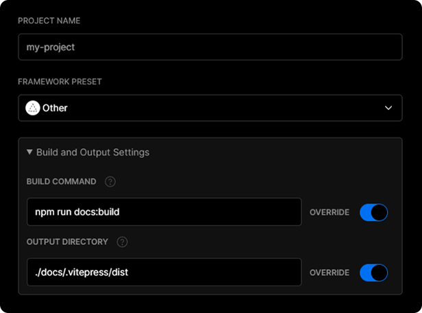

# 部署

下面的指南基于以下前提：

-   你的文档放置在你的项目的 `docs` 目录中；
-   你使用了默认的构建输出目录（`.rvpress/dist`）；
-   RVPress 作为一个本地依赖安装在你的项目中，并且你已经设置了以下 npm 脚本：

```json
{
    "scripts": {
        "docs:build": "rvpress build docs",
        "docs:serve": "rvpress serve docs"
    }
}
```

## 构建文档

执行 `npm run docs:build` 命令来构建文档。

```bash
$ npm run docs:build
```

默认情况下，构建输出将被放置在 `.rvpress/dist` 目录中。您可以将该目录部署到任何您喜欢的平台。

### 本地测试文档

一旦构建完成，您可以通过执行 `npm run docs:serve` 命令来在本地测试文档。

```bash
$ npm run docs:build
$ npm run docs:serve
```

`serve` 命令会启动一个本地的静态 web 服务器，它将把 `.rvpress/dist` 目录下的文件提供到 `http://localhost:5000` 访问。它是在本地环境中检查构建是否正常的一个简单的方式。

你可以通过 `--port` 参数来配置服务器的端口。

```json
{
    "scripts": {
        "docs:serve": "rvpress serve docs --port 8080"
    }
}
```

修改后 `docs:serve` 会在 `http://localhost:8080` 上启动。

## GitHub Pages 配置

1. 首先，在 `docs/.rvpress/config.js` 中设置正确的 `base`。

    如果你想部署到 `https://<USERNAME>.github.io/`，你可以忽略 `base`，它默认为 `'/'`。

    如果你想部署到 `https://<USERNAME>.github.io/<REPO>/`，你可以设置 `base` 为 `'/<REPO>/'`。

2. 进入项目目录，创建 `deploy.sh` 文件，并在其中添加如下内容（注意高亮行），然后运行它来部署：

```bash{13,20,23}
#!/usr/bin/env sh

# abort on errors
set -e

# build
npm run docs:build

# navigate into the build output directory
cd docs/.rvpress/dist

# if you are deploying to a custom domain
# echo 'www.example.com' > CNAME

git init
git add -A
git commit -m 'deploy'

# if you are deploying to https://<USERNAME>.github.io
# git push -f git@github.com:<USERNAME>/<USERNAME>.github.io.git master

# if you are deploying to https://<USERNAME>.github.io/<REPO>
# git push -f git@github.com:<USERNAME>/<REPO>.git master:gh-pages

cd -
```

::: tip
你也可以在 CI 设置中运行上面的脚本来启用提交自动部署。
:::

### GitHub Pages 和 Travis CI

1. 首先，在 `docs/.rvpress/config.js` 中设置正确的 `base`。

    如果你想部署到 `https://<USERNAME>.github.io/`，你可以忽略 `base`，它默认为 `'/'`。

    如果你想部署到 `https://<USERNAME>.github.io/<REPO>/`，你可以设置 `base` 为 `'/<REPO>/'`。

2. 在根目录下创建一个名为 `.travis.yml` 的文件。

3. 本地执行 `yarn` 或 `npm install`，并将生成的 lock 文件提交（如 `yarn.lock` 或 `package-lock.json`）。

4. 使用 GitHub Pages 部署模版，并遵循 [Travis CI 文档](https://docs.travis-ci.com/user/deployment/pages/)。

```yaml
language: node_js
node_js:
    - lts/*
install:
    - yarn install # npm ci
script:
    - yarn docs:build # npm run docs:build
deploy:
    provider: pages
    skip_cleanup: true
    local_dir: docs/.vitepress/dist
    # A token generated on GitHub allowing Travis to push code on you repository.
    # Set in the Travis settings page of your repository, as a secure variable.
    github_token: $GITHUB_TOKEN
    keep_history: true
    on:
        branch: master
```

## GitLab Pages and GitLab CI

1. Set the correct `base` in `docs/.vitepress/config.js`.

    If you are deploying to `https://<USERNAME or GROUP>.gitlab.io/`, you can omit `base` as it defaults to `'/'`.

    If you are deploying to `https://<USERNAME or GROUP>.gitlab.io/<REPO>/`, for example your repository is at `https://gitlab.com/<USERNAME>/<REPO>`, then set `base` to `'/<REPO>/'`.

2. Set `outDir` in `.vitepress/config.js` to `../public`.

3. Create a file called `.gitlab-ci.yml` in the root of your project with the content below. This will build and deploy your site whenever you make changes to your content:

```yaml
image: node:10.22.0
pages:
    cache:
        paths:
            - node_modules/
    script:
        - yarn install # npm install
        - yarn docs:build # npm run docs:build
    artifacts:
        paths:
            - public
    only:
        - master
```

## Netlify

1. On [Netlify](https://netlify.com), setup up a new project from GitHub with the following settings:

-   **Build Command:** `vitepress build docs` or `yarn docs:build` or `npm run docs:build`
-   **Publish directory:** `docs/.vitepress/dist`

2. Hit the deploy button.

## Google Firebase

1. Make sure you have [firebase-tools](https://www.npmjs.com/package/firebase-tools) installed.

2. Create `firebase.json` and `.firebaserc` at the root of your project with the following content:

`firebase.json`:

```json
{
    "hosting": {
        "public": "./docs/.vitepress/dist",
        "ignore": []
    }
}
```

`.firebaserc`:

```js
{
 "projects": {
   "default": "<YOUR_FIREBASE_ID>"
 }
}
```

3. After running `yarn docs:build` or `npm run docs:build`, deploy using the command `firebase deploy`.

## Surge

1. First install [surge](https://www.npmjs.com/package/surge), if you haven’t already.

2. Run `yarn docs:build` or `npm run docs:build`.

3. Deploy to surge by typing `surge docs/.vitepress/dist`.

You can also deploy to a [custom domain](https://surge.sh/help/adding-a-custom-domain) by adding `surge docs/.vitepress/dist yourdomain.com`.

## Heroku

1. Install [Heroku CLI](https://devcenter.heroku.com/articles/heroku-cli).

2. Create a Heroku account by [signing up](https://signup.heroku.com).

3. Run `heroku login` and fill in your Heroku credentials:

```bash
$ heroku login
```

4. Create a file called `static.json` in the root of your project with the below content:

`static.json`:

```json
{
    "root": "./docs/.vitepress/dist"
}
```

This is the configuration of your site; read more at [heroku-buildpack-static](https://github.com/heroku/heroku-buildpack-static).

5. Set up your Heroku git remote:

```bash
# version change
$ git init
$ git add .
$ git commit -m "My site ready for deployment."

# creates a new app with a specified name
$ heroku apps:create example

# set buildpack for static sites
$ heroku buildpacks:set https://github.com/heroku/heroku-buildpack-static.git
```

6. Deploy your site:

```bash
# publish site
$ git push heroku master

# opens a browser to view the Dashboard version of Heroku CI
$ heroku open
```

## Vercel

To deploy your VitePress app with a [Vercel for Git](https://vercel.com/docs/git), make sure it has been pushed to a Git repository.

Go to https://vercel.com/import/git and import the project into Vercel using your Git of choice (GitHub, GitLab or BitBucket). Follow the wizard to select the project root with the project's `package.json` and override the build step using `yarn docs:build` or `npm run docs:build` and the output dir to be `./docs/.vitepress/dist`



After your project has been imported, all subsequent pushes to branches will generate Preview Deployments, and all changes made to the Production Branch (commonly "main") will result in a Production Deployment.

Once deployed, you will get a URL to see your app live, such as the following: https://vitepress.vercel.app
